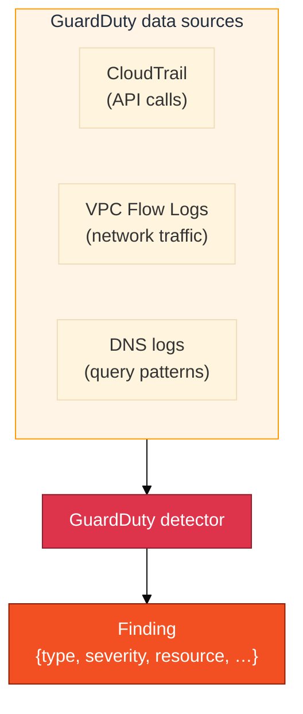
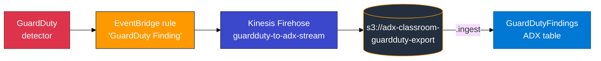
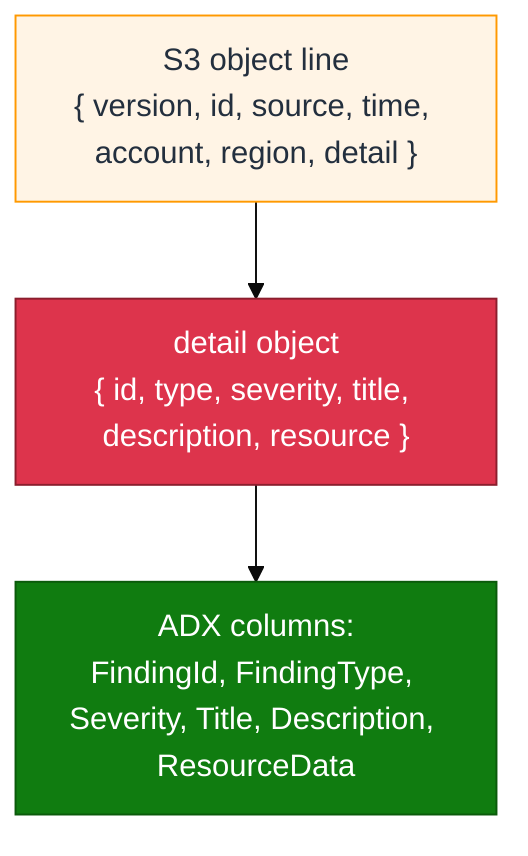

# Module 08 — GuardDuty primer

Read this **before** `08_GuardDuty_to_ADX_Concepts.md`.

## What GuardDuty is (plain English)

**Amazon GuardDuty** is a **threat detection** service. It continuously analyses your AWS environment's data sources — CloudTrail, VPC Flow Logs, DNS logs — and produces **findings**: structured JSON documents that describe a detected security issue.

A GuardDuty finding is not a raw log line you tail. It is a rich JSON object with a type, severity score, affected resources, timestamps, and a description of why the activity is suspicious.

---

## Finding vs log line

| | CloudTrail event (M02) | GuardDuty finding (M08) |
|---|---|---|
| **Shape** | One API call | One detected security pattern |
| **Format** | JSON — one action | JSON — aggregated signals |
| **Severity** | Not scored | Numerical (0–10 scale) |
| **Volume** | One row per API call | One row per distinct threat type |
| **Purpose** | Audit trail | Security alert |

You do not "turn on" CloudTrail to get GuardDuty findings. GuardDuty reads CloudTrail internally. The finding that emerges is a higher-level object — not a raw log line.

---

## Classroom export path

You do **not** create or manage the GuardDuty detector, the EventBridge rule, the Firehose delivery stream, or the landing S3 bucket. The trainer has provisioned all of that. Your role is:

1. Trigger findings (using the AWS **Generate sample findings** button).
2. Wait for them to reach S3 via the already-running Firehose.
3. Create an IAM reader, create your ADX table, and ingest.

Same buffering idea as Module 03 (CloudWatch Firehose): after you trigger findings, **wait 60–90 seconds** for Firehose to flush its buffer and write an S3 object.

---

## The EventBridge envelope

S3 objects do not contain the raw GuardDuty finding JSON directly. They contain **EventBridge event envelopes** — one JSON document per line (NDJSON / multijson). The finding fields live one level deeper, inside the `detail` key.

Critical mapping rules:

| JSON path in envelope | ADX column | Common mistake |
|---|---|---|
| `$.time` | `EventTime` | — |
| `$.account` | `AccountId` | — |
| `$.region` | `Region` | — |
| `$.detail.id` | `FindingId` | **Not** `$.id` (that is the envelope event ID, not the finding ID) |
| `$.detail.type` | `FindingType` | — |
| `$.detail.severity` | `Severity` | — |
| `$.detail.title` | `Title` | — |
| `$.detail.description` | `Description` | — |
| `$.detail.resource` | `ResourceData` | — |

If you map `$.id` instead of `$.detail.id`, ingest succeeds but `FindingId` is empty for every row.

---

## Generate sample findings — what this does

GuardDuty has a built-in **Generate sample findings** button (Settings → Generate sample findings in the console). This tells the GuardDuty service to emit one sample finding for every supported finding type. These are real GuardDuty objects — they flow through EventBridge, Firehose, and S3 exactly as production findings would. The only difference is they are labeled as `[SAMPLE]` in their titles.

This is an AWS product feature, not a custom shell script that writes fake JSON. Ingest scripts in this lab only **list the S3 bucket** and **load into ADX** — they do not write finding data.

---

## Hands-on orientation (console — before starting lab steps)

1. Open **GuardDuty** in the AWS console → **Summary** — confirm the detector is enabled.
2. Click **Findings** — note the `Type`, `Severity`, and `Resource` columns.
3. Click **Settings** — locate the **Generate sample findings** button (you will use it in Step 1).
4. Open **S3** → `adx-classroom-guardduty-export` → browse the `guardduty/` prefix.

**Checkpoint:** You can explain the difference between a GuardDuty finding and a raw CloudTrail API event.

---

## Common mistakes

| Mistake | Result |
|---------|--------|
| Map `$.id` instead of `$.detail.id` | Ingest succeeds; `FindingId` is empty for all rows |
| Create IAM reader on the Module 01 inventory bucket | Wrong permissions; ingest fails with Access Denied |
| Query ADX immediately after Generate sample findings | Empty table — Firehose needs 60–90 s to flush |
| Expect live threat findings in a short lab session | Sample findings are the reliable classroom source; live threats may or may not appear |
| Create or delete the GuardDuty detector | Do not — trainer owns it; toggling disrupts the whole class |
