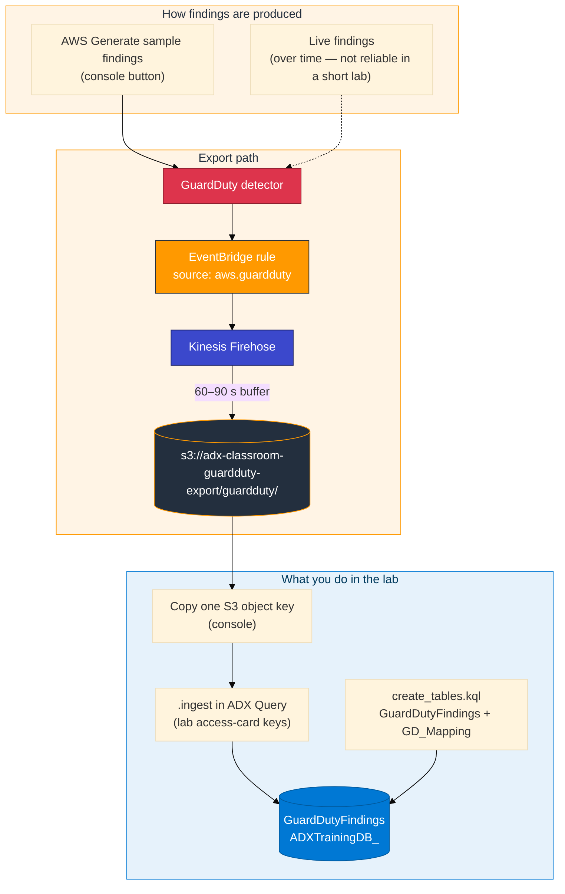
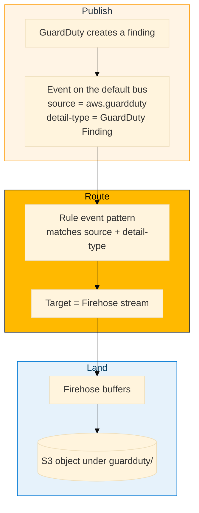

# Module 08 — GuardDuty to ADX

> **Reading order:** `08_GuardDuty_Primer.md` → Concepts (this file) → Lab → Exercises.

## What this module is trying to solve

Modules 02 and 03 gave you AWS operational data in ADX — API audit events (CloudTrail) and application log messages (CloudWatch). Neither is optimised for **security alerting**. They record *what happened*; they do not score *how suspicious* it is.

**GuardDuty** fills that gap. It analyses those kinds of signals and emits structured **findings** — each with a type, severity, affected resource, and description. Bringing findings into ADX lets you correlate them with CloudTrail and CloudWatch on the same timeline.

This module also teaches a transport pattern you will see often in AWS security: **EventBridge → Firehose → S3** (same shape as many Security Hub / Config-style exports).

In the lab you work mainly in the **AWS console** and the **ADX query** page, using your normal lab login from the access card.

---

## Full data path from detection to ADX row



---

## EventBridge in depth

**Amazon EventBridge** is a serverless event router.



| Term | Meaning in Module 08 |
|------|----------------------|
| Event bus | Default bus in the account / region |
| Event pattern | Filters on `source` and `detail-type` |
| Target | Firehose delivery stream that writes to the classroom bucket |
| Envelope | JSON wrapper EventBridge adds; finding payload is under **`detail`** |

Without EventBridge (or an equivalent integration), a finding would sit in the GuardDuty console only — it would not automatically appear in your S3 landing prefix.

---

## The EventBridge envelope (why `$.detail.*` matters)

Firehose writes EventBridge records to S3. Each record looks conceptually like this:

```json
{
  "version": "0",
  "id": "12345678-abcd-...",
  "source": "aws.guardduty",
  "account": "123456789012",
  "time": "2026-09-03T10:00:00Z",
  "region": "us-east-1",
  "detail-type": "GuardDuty Finding",
  "detail": {
    "id": "abc123def456...",
    "type": "Recon:IAMUser/TorIPCaller",
    "severity": 5.0,
    "title": "[SAMPLE] API from Tor exit node",
    "description": "...",
    "resource": { "resourceType": "AccessKey" }
  }
}
```

| Path | Meaning |
|------|---------|
| `$.id` | EventBridge **routing** event ID — unique to the delivery event |
| `$.detail.id` | GuardDuty **finding** ID — use this in ADX |
| `$.detail.type` | Finding type for analytics |

This is the most common mapping mistake in the module: using `$.id` / `$.type` instead of `$.detail.id` / `$.detail.type`. Ingest may succeed while columns stay empty.

A fuller sample lives in `assets/module_08/sample_eventbridge_envelope.json`.

---

## Ingestion format and mapping (`GD_Mapping`)

ADX ingests these objects as **multijson** (JSON documents — often one after another in a Firehose file). The mapping `GD_Mapping` tells ADX how to extract columns:

| JSON path | Column | Type | Notes |
|-----------|--------|------|-------|
| `$.time` | `EventTime` | datetime | Envelope time |
| `$.account` | `AccountId` | string | AWS account |
| `$.region` | `Region` | string | Region |
| `$.detail.id` | `FindingId` | string | **Not** `$.id` |
| `$.detail.type` | `FindingType` | string | e.g. `Recon:IAMUser/TorIPCaller` |
| `$.detail.severity` | `Severity` | real | 0–10 |
| `$.detail.title` | `Title` | string | Short title |
| `$.detail.description` | `Description` | string | Narrative |
| `$.detail.resource` | `ResourceData` | dynamic | Resource shape varies by finding type |

`ResourceData` is `dynamic` because EC2, IAM, S3, and other resource shapes differ. Query examples: `tostring(ResourceData.resourceType)`.

---

## What “Generate sample findings” does

From the console: GuardDuty → **Settings** → **Generate sample findings**.

1. GuardDuty creates sample finding objects (many types at once).  
2. EventBridge matches `source = aws.guardduty`.  
3. Firehose receives the events.  
4. After buffering (**60–90 seconds**), Firehose writes under `s3://adx-classroom-guardduty-export/guardduty/`.

Samples are real GuardDuty objects on the production-style path. The usual marker is `[SAMPLE]` in the title. For learning ingest and `$.detail.*` mapping, they are the right classroom source — waiting for a real attack in a two-hour lab is not practical.

---

## `FindingType` as the analytics key

Finding types often look like `Category:Resource/ThreatName`:

- `Recon:IAMUser/TorIPCaller`  
- `UnauthorizedAccess:EC2/SSHBruteForce`  
- `Discovery:S3/MaliciousIPCaller`  

In ADX:

```kusto
GuardDutyFindings
| summarize Count = count() by FindingType, Severity
| order by Severity desc
```

If `FindingType` is empty for all rows, the mapping path for `$.detail.type` is almost certainly wrong.

---

## Relationship to earlier modules

| Earlier module | Connection to M08 |
|---|---|
| M02 CloudTrail | GuardDuty reads CloudTrail; some finding types refer to CloudTrail-related activity |
| M03 CloudWatch → Firehose | Same Firehose buffering idea (wait before S3); M03 used a subscription filter, M08 uses EventBridge |
| M04 Hybrid | Findings can later sit on a unified timeline with other AWS logs |

---

## Prerequisites

| Prerequisite | Why |
|---|---|
| M02 / M03 completed | Familiar with S3 landing + `.ingest` and Firehose delay |
| AWS console as your lab user | Generate findings; browse the landing bucket |
| Access-card Access Key + Secret | Used in the ADX `.ingest` URI (same user as console — no extra IAM user) |
| ADX database | `ADXTrainingDB_<your-login>` |

---

## Lab flow (summary)

1. Console: **Generate sample findings** → wait 60–90 s.  
2. Console: open `adx-classroom-guardduty-export` / `guardduty/` → copy an object key.  
3. ADX: run `create_tables.kql`.  
4. ADX: `.ingest` that object with your lab keys.  
5. Query by `FindingType` / `Severity`.

Details and click path: `08_GuardDuty_to_ADX_Lab.md`.
