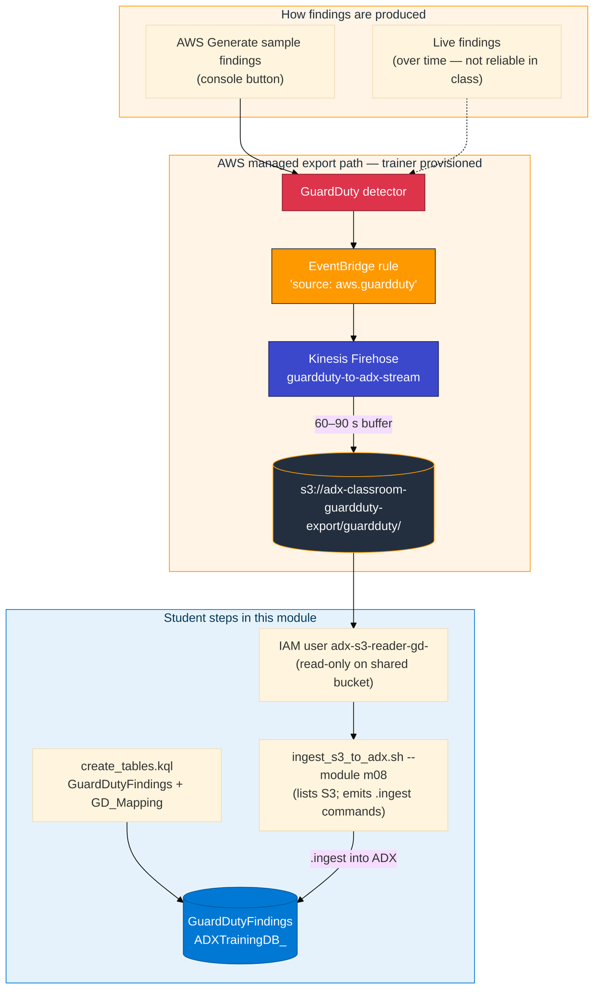

# Module 08 — GuardDuty to ADX

> **Reading order:** `08_GuardDuty_Primer.md` → Concepts (this file) → Lab → Exercises.

## What this module is trying to solve

Modules 02 and 03 gave you two types of AWS operational data in ADX — API audit events (CloudTrail) and application log messages (CloudWatch). Neither of those is optimised for security alerting. They record *what happened* but they do not score or categorise *how suspicious* something is.

GuardDuty fills that gap. It analyses those same data sources and emits structured **findings** — each one is a scored security anomaly with a type, severity, affected resource, and description. Bringing those findings into ADX lets you correlate them with your CloudTrail and CloudWatch data on the same timeline.

This module also introduces a new AWS transport pattern: **EventBridge → Firehose → S3**. Understanding this pattern is useful beyond GuardDuty — it is the same shape used for many AWS security services (Security Hub, Config, Inspector).

---

## Full data path from detection to ADX row



---

## The EventBridge envelope in depth

Firehose writes EventBridge event records to S3, not raw GuardDuty JSON. Each line of an S3 object is one EventBridge record:

```json
{
  "version": "0",
  "id": "12345678-abcd-...",
  "source": "aws.guardduty",
  "account": "123456789012",
  "time": "2026-08-31T10:00:00Z",
  "region": "us-east-1",
  "detail-type": "GuardDuty Finding",
  "detail": {
    "id": "abc123def456...",
    "type": "Recon:IAMUser/TorIPCaller",
    "severity": 5.0,
    "title": "[SAMPLE] API from Tor exit node",
    "description": "...",
    "resource": { "resourceType": "AccessKey", ... }
  }
}
```

The top-level `id` is the **EventBridge event ID** — unique to the routing event, not the security finding. The actual GuardDuty finding ID is `detail.id`. This is the most common ingestion mistake in this module.

---

## Ingestion format and mapping

ADX ingests the S3 objects as **multijson** (NDJSON — one JSON object per line). The mapping `GD_Mapping` tells ADX how to extract columns from the envelope:

| JSON path | Column | Type | Notes |
|-----------|--------|------|-------|
| `$.time` | `EventTime` | datetime | Envelope routing time |
| `$.account` | `AccountId` | string | AWS account that owns the detector |
| `$.region` | `Region` | string | AWS region |
| `$.detail.id` | `FindingId` | string | **Use `$.detail.id` — not `$.id`** |
| `$.detail.type` | `FindingType` | string | e.g. `Recon:IAMUser/TorIPCaller` |
| `$.detail.severity` | `Severity` | real | 0–10 numerical score |
| `$.detail.title` | `Title` | string | Short description |
| `$.detail.description` | `Description` | string | Full detection narrative |
| `$.detail.resource` | `ResourceData` | dynamic | Full resource sub-object as JSON |

`ResourceData` is a `dynamic` column because the resource shape differs by finding type (EC2 instance, IAM role, S3 bucket, etc.). You query it with `tostring(ResourceData.resourceType)` or similar.

---

## IAM reader — why a separate user

The shared export bucket `adx-classroom-guardduty-export` contains findings from all classroom accounts. Students need **read access** to that bucket (specifically `s3:GetObject`, `s3:ListBucket`), but the ingest script only **reads** from S3 — it never writes. A minimal IAM user with read-only policy on this one bucket is the correct scope.

The user name `adx-s3-reader-gd-<your-login>` is per-student to avoid credential confusion and to make it easy for the trainer to see who created what in the account.

This bucket is **not** the Module 01 inventory bucket (`adx-classroom-inventory-...`). A common mistake is reusing Module 01 credentials. They will fail with Access Denied.

---

## What `generate sample findings` actually does

From the AWS console: GuardDuty → Settings → **Generate sample findings** fires one sample finding for each supported finding type (there are dozens). Each flows through:

1. GuardDuty service creates the finding object.
2. EventBridge rule fires (`source = aws.guardduty`).
3. Firehose receives the EventBridge event.
4. Firehose buffers for 60–90 seconds, then writes an S3 object.

These are real GuardDuty objects travelling the production path. The only indicator they are samples is `[SAMPLE]` in the title and `SAMPLE_FINDING` in the source metadata. For learning the ADX ingestion pipeline, they are identical to production findings.

Ingest scripts in this lab only **list** S3 and **load** ADX. They do not write fake finding JSON.

---

## `FindingType` as the primary analytics key

GuardDuty finding types follow the pattern `Category:Resource/ThreatName`, for example:

- `Recon:IAMUser/TorIPCaller` — reconnaissance using a Tor exit node
- `UnauthorizedAccess:EC2/SSHBruteForce` — SSH brute force on EC2
- `Discovery:S3/MaliciousIPCaller` — S3 bucket exploration from a known-bad IP

In ADX you will summarise by `FindingType` and `Severity` to get a threat overview:

```kusto
GuardDutyFindings
| summarize Count = count() by FindingType, Severity
| order by Severity desc
```

If `FindingType` is empty for all rows, it almost certainly means the mapping used `$.detail.type` incorrectly or the wrong path was specified.

---

## Relationship to earlier modules

| Earlier module | Connection to M08 |
|---|---|
| M02 CloudTrail | GuardDuty reads CloudTrail; a `FindingType` of `Stealth:IAMUser/CloudTrailLoggingDisabled` links directly to CloudTrail activity |
| M03 CloudWatch → Firehose | Same Firehose buffering concept (60–90 s), same `.ingest` pattern |
| M04 Hybrid | `GuardDutyFindings` rows can be projected into `UnifiedHybridLogs` as high-severity events alongside other AWS logs |

---

## Prerequisites

| Prerequisite | Why |
|---|---|
| M02 / M03 completed | Familiar with Firehose → S3 → `.ingest` pattern |
| AWS console access | Need to click Generate sample findings; read S3 object listing |
| IAM permissions to create users | To create `adx-s3-reader-gd-<login>` (trainer grants if needed) |
| ADX database | `ADXTrainingDB_<your-login>` — same as all earlier modules |
