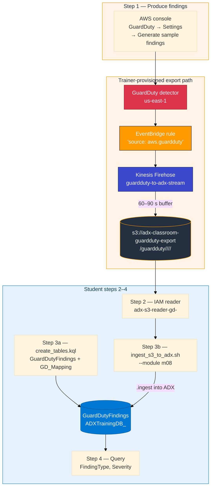
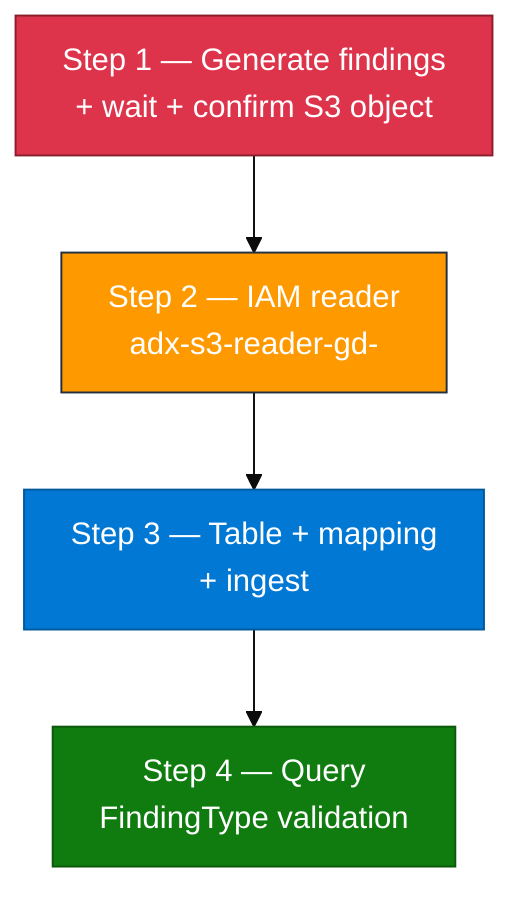

# Module 08 — Lab (GuardDuty → EventBridge → Firehose → S3 → ADX)

**Reading order:** `08_GuardDuty_Primer.md` → `08_GuardDuty_to_ADX_Concepts.md` → **this Lab** → `08_Exercises.md`.

**Database:** `ADXTrainingDB_<your-login>` (example: `ADXTrainingDB_u01`).

**KQL files:** `assets/module_08/`.

**Shared bucket:** `adx-classroom-guardduty-export`.

---

## 1. What this lab is about (plain English)

You have seen two AWS data ingest patterns so far:

| Module | Pattern | Source |
|--------|---------|--------|
| M02 | CloudTrail JSON → S3 → `.ingest` | API audit events |
| M03 | CloudWatch → Firehose → S3 → `.ingest` | Application log lines |

Module 08 adds a third AWS data source: **GuardDuty security findings**. The export path is similar to Module 03 but adds EventBridge as a routing layer:

```
GuardDuty detector → EventBridge rule → Kinesis Firehose → S3 → your .ingest → ADX
```

You do **not** build the detector, EventBridge rule, Firehose, or S3 bucket. The trainer has provisioned all of that. Your job is:

1. Trigger findings by using the AWS **Generate sample findings** feature.
2. Wait 60–90 seconds for Firehose to flush to S3.
3. Create a minimal IAM read-only user for the shared export bucket.
4. Create the `GuardDutyFindings` table with the correct mapping in your ADX database.
5. Run the ingest script and query your findings.

**Rule:** Findings come from the **GuardDuty service** — triggered by the console button or by real detections. The ingest script only **lists S3** and **loads ADX**. It does not write finding JSON files.

---

## 2. How data travels (source → destination)

### 2.1 The full journey



### 2.2 The EventBridge envelope — why `$.detail.*` matters

S3 objects written by Firehose contain **EventBridge event envelopes**, one JSON document per line. The GuardDuty finding fields live inside the `detail` key — not at the top level. This is the most important structural detail in this module.

```
Top-level envelope keys:
  $.version, $.id, $.source, $.account, $.time, $.region, $.detail-type, $.detail

$.id      → EventBridge routing event ID  ← NOT the finding ID
$.detail.id   → GuardDuty finding ID      ← USE THIS
$.detail.type → GuardDuty finding type    ← USE THIS
```

If your ADX mapping points to `$.id` instead of `$.detail.id`, the ingestion command succeeds but every row will have an empty `FindingId` — a silent mistake that is hard to spot later.

### 2.3 Firehose buffering

Firehose accumulates events until either a size limit or a time limit is reached before writing an S3 object. In this classroom setup the time buffer is **60–90 seconds**. After clicking Generate sample findings, wait the full duration before listing S3.

---

## 3. Lab steps overview



---

## Before Step 1 — open the correct database and check prerequisites

### Open your ADX database

1. Azure portal → subscription **Pay-As-You-Go** → resource group `rg-adx-training-aug26` → cluster `adxtrainaug26` → **Query**.
2. Database dropdown → `ADXTrainingDB_<your-login>`.
3. Run:

```kusto
print Database = current_database()
```

It must match your login database. If not, fix the dropdown before continuing.

### Check AWS console access

Confirm you can reach the AWS console with your student credentials and see the GuardDuty service in `us-east-1`. If GuardDuty is not visible, ask the trainer — the detector may need to be re-enabled after a cost-saving cleanup.

---

## Step 1 — Generate GuardDuty findings and confirm they reach S3

### Goal

Get GuardDuty findings flowing through the trainer-provisioned EventBridge → Firehose → S3 export path so you have real data to ingest.

### Why "Generate sample findings" is the classroom approach

A real GuardDuty finding requires actual suspicious activity (a Tor exit node calling your API, a compromised key making unusual API calls, etc.). Waiting for a real threat in a short lab session is not practical. The **Generate sample findings** button tells the GuardDuty service to emit one sample for every supported finding type. These travel through the **same** EventBridge → Firehose → S3 path as production findings. The only difference is the title prefix `[SAMPLE]`. For the purpose of learning the ingest pipeline, they are identical.

### Do this exactly

1. In the AWS console, navigate to **GuardDuty** → left navigation → **Settings**.
2. Scroll to the **Sample findings** section.
3. Click **Generate sample findings**.
4. A confirmation message appears: "Generating sample findings. They will appear in the Findings page."
5. Navigate to **Findings** in GuardDuty. Wait 10–30 seconds. Sample findings should appear (they appear in the console faster than they reach S3 — the console populates from the GuardDuty API, not from S3).
6. **Now wait 60–90 seconds** for Firehose to flush the EventBridge events to S3.
7. Confirm the S3 object exists:

```bash
aws s3 ls s3://adx-classroom-guardduty-export/guardduty/ --recursive | tail -5
```

You should see one or more object keys under a path like `guardduty/2026/08/31/`.

### Checkpoint

- Objects appear under `s3://adx-classroom-guardduty-export/guardduty/` dated today
- The finding count in the GuardDuty Findings console is > 0

### If something is wrong

| Symptom | Fix |
|---------|-----|
| GuardDuty console shows "Detector not enabled" | Ask trainer — detector was cleaned up; takes 1–2 minutes to re-enable |
| S3 listing is empty after 90 seconds | Either Firehose buffer not reached (wait another 60 s) or EventBridge rule paused — ask trainer |
| `aws s3 ls` access denied | Your student AWS credentials may not have S3 list on this bucket; that is expected — the dedicated IAM reader (Step 2) handles this |
| Findings appear in console but not S3 | Normal — console reflects GuardDuty API directly; S3 reflects Firehose buffer (60–90 s delay) |

---

## Step 2 — Create IAM reader `adx-s3-reader-gd-<your-login>`

### Goal

Create a minimal IAM user that can read from the shared export bucket. The ingest script will use this user's access keys to list and download S3 objects.

### Why a new user (not your console user or Module 01 keys)

Your AWS student console user may have broad permissions — using it for script-based access is a larger credential surface than needed. The ingest script needs only `s3:GetObject` and `s3:ListBucket` on one specific bucket. A dedicated reader user with a scoped policy is the least-privilege approach. Module 01 used a different bucket (`adx-classroom-inventory-...`) — those keys will fail here with Access Denied.

### Do this exactly

1. Open the AWS console → **IAM** → **Users** → **Create user**.
2. User name: `adx-s3-reader-gd-<your-login>` (example: `adx-s3-reader-gd-u01`).
3. Skip "Add to group" — you will attach an inline policy.
4. On the created user page, click **Add permissions** → **Attach policies directly** → **Create inline policy** → JSON tab:

```json
{
  "Version": "2012-10-17",
  "Statement": [
    {
      "Effect": "Allow",
      "Action": [
        "s3:GetObject",
        "s3:ListBucket"
      ],
      "Resource": [
        "arn:aws:s3:::adx-classroom-guardduty-export",
        "arn:aws:s3:::adx-classroom-guardduty-export/*"
      ]
    }
  ]
}
```

5. Name the policy `adx-gd-reader-policy-<your-login>` and save.
6. Go to the user's **Security credentials** tab → **Create access key** → select **Other** → create.
7. Download or copy the Access Key ID and Secret Access Key.
8. Save to `~/adx-lab-m08/reader.env`:

```bash
mkdir -p ~/adx-lab-m08
cat > ~/adx-lab-m08/reader.env << 'EOF'
export AWS_ACCESS_KEY_ID=AKIA...
export AWS_SECRET_ACCESS_KEY=...
export AWS_DEFAULT_REGION=us-east-1
EOF
chmod 600 ~/adx-lab-m08/reader.env
```

9. Test the reader:

```bash
source ~/adx-lab-m08/reader.env
aws s3 ls s3://adx-classroom-guardduty-export/guardduty/ --recursive | tail -5
```

### Checkpoint

- `aws s3 ls` with the reader credentials lists objects under `guardduty/`
- No Access Denied errors
- `reader.env` is in place with the correct key values

### If something is wrong

| Symptom | Fix |
|---------|-----|
| Access Denied on `s3 ls` | Policy may be missing the bucket ARN (without `/*`) for `s3:ListBucket` — both ARN forms are needed |
| No objects listed | Step 1 findings may not have reached S3 yet; wait another 60 s and re-run |
| User already exists | Earlier attempt; delete the old user or reuse its keys if still available |
| Wrong bucket in policy | Must be `adx-classroom-guardduty-export`, not your Module 01 bucket |

---

## Step 3 — Create `GuardDutyFindings` table, mapping, and ingest

### Goal

Create the ADX table with the `GD_Mapping` that correctly reads from `$.detail.*`, then ingest the S3 objects into your database.

### What `create_tables.kql` creates

| Object | Name | Purpose |
|--------|------|---------|
| Table | `GuardDutyFindings` | One row per GuardDuty finding: time, account, region, type, severity, title, etc. |
| Mapping | `GD_Mapping` | Column mappings using `$.time`, `$.account`, `$.region`, `$.detail.id`, `$.detail.type`, `$.detail.severity`, `$.detail.title`, `$.detail.description`, `$.detail.resource` |
| Ingestion format | `multijson` | S3 objects are NDJSON — one EventBridge envelope per line |

### Do this exactly

**Part A — Create the table and mapping:**

1. Confirm database:
```kusto
print Database = current_database()
```

2. Open `assets/module_08/create_tables.kql` and run it in your ADX database.

3. Verify:
```kusto
.show tables
| where TableName == "GuardDutyFindings"
```

```kusto
.show table GuardDutyFindings ingestion mappings
| where MappingKind == "Json" and Name == "GD_Mapping"
```

The mapping must show 9 columns including `FindingId` pointing to `$.detail.id` (not `$.id`).

**Part B — Ingest from S3:**

Option 1 — Use the ingest shell script (recommended):

```bash
source ~/adx-lab-m08/reader.env
bash assets/ingest_s3_to_adx.sh \
  --module m08 \
  --login <your-login> \
  --region us-east-1 \
  --max 5 \
  --run
```

This script lists objects in `s3://adx-classroom-guardduty-export/guardduty/` and generates `.ingest` KQL commands pointing at those objects. It does not write or modify S3 objects.

Option 2 — Paste the generated KQL manually (if script fails):

The script in `--run` mode also writes a KQL file to `~/adx-lab-s3/m08/ingest_generated.kql`. Open that file and paste its contents into the ADX Web UI query editor, then execute.

A `.ingest` command for a single object looks like:

```kusto
.ingest into table GuardDutyFindings
  (h'https://adx-classroom-guardduty-export.s3.amazonaws.com/guardduty/2026/08/31/...')
  with (format='multijson', ingestionMappingReference='GD_Mapping')
```

### Checkpoint

```kusto
GuardDutyFindings | count
```

Must be **> 0**. Wait a few seconds after running `.ingest` — direct ingest (not queued) is fast but not instantaneous.

```kusto
GuardDutyFindings
| take 5
| project EventTime, AccountId, Region, FindingId, FindingType, Severity
```

- `FindingId` must be non-empty (not blank)
- `FindingType` must be non-empty (e.g. `Recon:IAMUser/TorIPCaller`)
- `Severity` must be a number (e.g. 5.0, 8.0)

### If something is wrong

| Symptom | Fix |
|---------|-----|
| `GuardDutyFindings | count` = 0 | `.ingest` may have failed — check for error output; re-run ingest command |
| `FindingId` empty for all rows | Mapping uses `$.id` instead of `$.detail.id` — re-run `create_tables.kql` with the correct path, then re-ingest |
| `FindingType` empty | Same cause — wrong mapping path for `$.detail.type` |
| `.ingest` fails with Access Denied | IAM reader credentials not loaded (`source ~/adx-lab-m08/reader.env`) or policy missing `s3:GetObject` |
| Table not found | Re-run `create_tables.kql` in your own database |
| Mapping not found | Re-run the mapping creation part of `create_tables.kql` |

---

## Step 4 — Query `GuardDutyFindings`

### Goal

Verify the data shape, validate `FindingType` population, and explore the severity distribution.

### Do this exactly

1. Run `assets/module_08/validate.kql` in your database.

**Row count and type coverage:**

```kusto
GuardDutyFindings | count
```

```kusto
GuardDutyFindings
| summarize Count = count() by FindingType
| order by Count desc
```

For sample findings you expect one row per supported finding type (20–30+ types). If `FindingType` is empty for all rows, the mapping is wrong — go back to Step 3.

**Severity distribution:**

```kusto
GuardDutyFindings
| summarize Count = count() by Severity
| order by Severity desc
```

**Finding type breakdown with severity:**

```kusto
GuardDutyFindings
| summarize Count = count() by FindingType, Severity
| order by Severity desc, Count desc
```

**Inspect a specific finding's resource:**

```kusto
GuardDutyFindings
| where isnotnull(ResourceData)
| take 5
| project FindingType, Severity, tostring(ResourceData)
```

**High-severity findings:**

```kusto
GuardDutyFindings
| where Severity >= 7
| project EventTime, FindingType, Severity, Title
| order by Severity desc
```

2. Continue with `assets/module_08/explore.kql` then `08_Exercises.md`.

### Checkpoint

- `GuardDutyFindings | count` > 0
- `FindingType` is populated (non-empty) for all rows
- `Severity` values are numeric (not null)
- `FindingId` is populated (non-empty) for all rows — confirms `$.detail.id` mapping is correct

### You are done when

- You can trace the full path: GuardDuty → EventBridge → Firehose → S3 → `.ingest` → `GuardDutyFindings`
- You can explain why `$.detail.id` is used for `FindingId` instead of `$.id`
- You can show a `summarize count() by FindingType` result with multiple types
- You used the **Generate sample findings** button — not a custom script to write JSON — to produce the data

---

## Quick failure guide

| Problem | Likely cause | Fix |
|---------|--------------|-----|
| GuardDuty "Detector not enabled" | Cost cleanup paused it | Ask trainer; takes 1–2 min to re-enable |
| S3 object listing empty | Firehose buffer not flushed yet | Wait additional 60 s; re-list |
| S3 Access Denied when listing | Reader policy missing `s3:ListBucket` ARN | Add bucket ARN (no trailing `/*`) to policy |
| S3 Access Denied when ingesting | Reader policy missing `s3:GetObject` | Policy present but wrong ARN — fix and re-test |
| `FindingId` empty | Mapping uses `$.id` (envelope ID) not `$.detail.id` | Recreate mapping with correct path; re-ingest |
| `FindingType` empty | Mapping uses `$.type` not `$.detail.type` | Same fix as above |
| `GuardDutyFindings | count` = 0 after ingest | `.ingest` ran against wrong database or wrong bucket objects | Confirm database, confirm objects exist, re-run ingest |
| Wrong database | Dropdown set to a classmate DB | `print Database = current_database()`; fix dropdown |
| Using Module 01 keys | Different bucket, different permissions | Create the dedicated `adx-s3-reader-gd-<login>` user |
| Trying to build EventBridge rule | Trainer already built it | Do not create or modify the EventBridge rule or Firehose |
