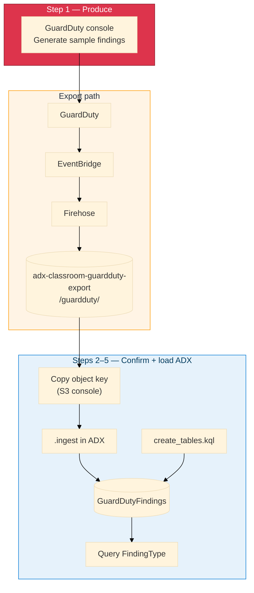

# Module 08 — Lab (GuardDuty → EventBridge → Firehose → S3 → ADX)

**Reading order:** Primer → Concepts → **this Lab** → Exercises.

**Database:** `ADXTrainingDB_<your-login>`.

**KQL files:** `assets/module_08/`.

**S3 bucket:** `adx-classroom-guardduty-export` (prefix `guardduty/`).

**AWS sign-in:** your normal lab IAM user from the access card. Region **`us-east-1`**.

The **practical** steps below are short and console-first. Read Primer + Concepts for the full “why” (EventBridge, envelope, mapping).

---

## 1. What this lab is about

You have already ingested:

| Module | Pattern |
|--------|---------|
| M02 | CloudTrail → S3 → `.ingest` |
| M03 | CloudWatch → Firehose → S3 → `.ingest` |

Module 08 adds **GuardDuty findings** with EventBridge in the middle:

```text
GuardDuty → EventBridge → Firehose → S3 → .ingest → GuardDutyFindings
```

**EventBridge** routes “a finding was created” to Firehose. S3 objects are **envelopes**; ADX mappings use `$.detail.*`.

After **Generate sample findings**, wait **60–90 seconds** for Firehose to write S3 (same buffering idea as Module 03).

---

## 2. How data travels (diagram)



**Envelope reminder**

| Path | Use for |
|------|---------|
| `$.id` | EventBridge event ID — **not** FindingId |
| `$.detail.id` | FindingId |
| `$.detail.type` | FindingType |

---

## Before Step 1

1. Azure portal → ADX → **Query** → `ADXTrainingDB_<your-login>`.  
2. `print Database = current_database()`  
3. AWS console → **US East (N. Virginia)** → **GuardDuty**.

---

## Step 1 — Generate findings (AWS console)

### Why

A real GuardDuty finding needs real suspicious activity. In class, **Generate sample findings** emits many sample types onto the **same** export path as live findings (titles often show `[SAMPLE]`).

### Do this

1. GuardDuty → **Settings**.  
2. **Generate sample findings**.  
3. Open **Findings** — samples appear in ~30 seconds (console reads the GuardDuty API, not S3).  
4. Wait **60–90 seconds** for Firehose.

### Checkpoint

Findings page shows sample rows.

---

## Step 2 — Confirm data in S3 (AWS console)

### Why

ADX will pull from an S3 object. You need a real key under `guardduty/`.

### Do this

1. **S3** → bucket **`adx-classroom-guardduty-export`**.  
2. Open **`guardduty/`** → year / month / day folders for today.  
3. Confirm at least one object exists.  
4. Open one object → copy the **key** (full path under the bucket).

### Checkpoint

You have a copied key such as `guardduty/2026/09/03/01/....`.

### If S3 looks empty

Wait another minute and refresh. If still empty, ask the trainer.

---

## Step 3 — Create the ADX table and mapping

### Why

`GD_Mapping` must read **`$.detail.*`**. Wrong paths produce empty `FindingId` / `FindingType` even when ingest “succeeds.”

### Do this

1. Run `assets/module_08/create_tables.kql` in your database.  
2. Verify:

```kusto
.show tables
| where TableName == "GuardDutyFindings"

.show table GuardDutyFindings ingestion mappings
```

Confirm `FindingId` → `$.detail.id` and `FindingType` → `$.detail.type`.

---

## Step 4 — Ingest from S3 (ADX Query)

### Why

`.ingest` downloads the S3 object into your table using the mapping. Use your **access-card** Access Key ID and Secret (same user as the AWS console). No separate IAM user for this module.

### Do this

```kusto
.ingest into table GuardDutyFindings
h@"https://adx-classroom-guardduty-export.s3.us-east-1.amazonaws.com/<object-key>;AwsCredentials=<AccessKeyId>,<SecretAccessKey>"
with (format="multijson", ingestionMappingReference="GD_Mapping")
```

| Placeholder | From |
|-------------|------|
| `<object-key>` | Key copied in Step 2 |
| `<AccessKeyId>` / `<SecretAccessKey>` | Access card lab keys |

Then:

```kusto
GuardDutyFindings | count
GuardDutyFindings
| take 5
| project EventTime, FindingId, FindingType, Severity
```

`FindingId` and `FindingType` must be non-empty. You may ingest one or two more objects the same way.

Template: `assets/module_08/ingest.kql`.

---

## Step 5 — Query

```kusto
GuardDutyFindings
| summarize Count = count() by FindingType, Severity
| order by Severity desc
```

Also run `assets/module_08/validate.kql` and `explore.kql`, then `08_Exercises.md`.

### Done when

- You generated findings and saw them in S3 (console)  
- ADX has rows with populated `FindingType`  
- You can explain EventBridge’s role and why mappings use `$.detail.*`

---

## Quick failure guide

| Problem | Fix |
|---------|-----|
| Empty S3 | Wait for Firehose buffer; ask trainer if still empty |
| `FindingId` empty | Mapping must use `$.detail.id` |
| Ingest auth error | Check access-card key/secret; no typos in the URI |
| Wrong database | `print Database = current_database()` |
| Console findings but no S3 yet | Normal until buffer flushes (60–90 s) |
