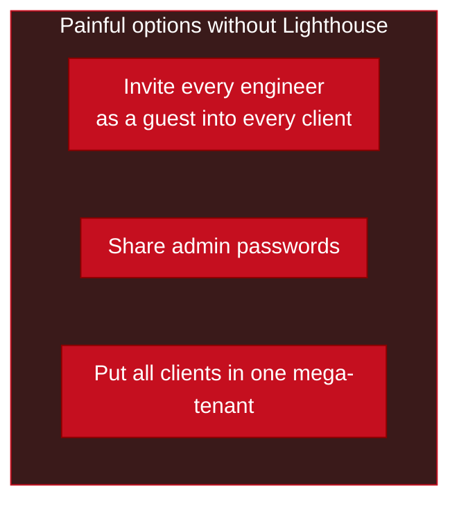
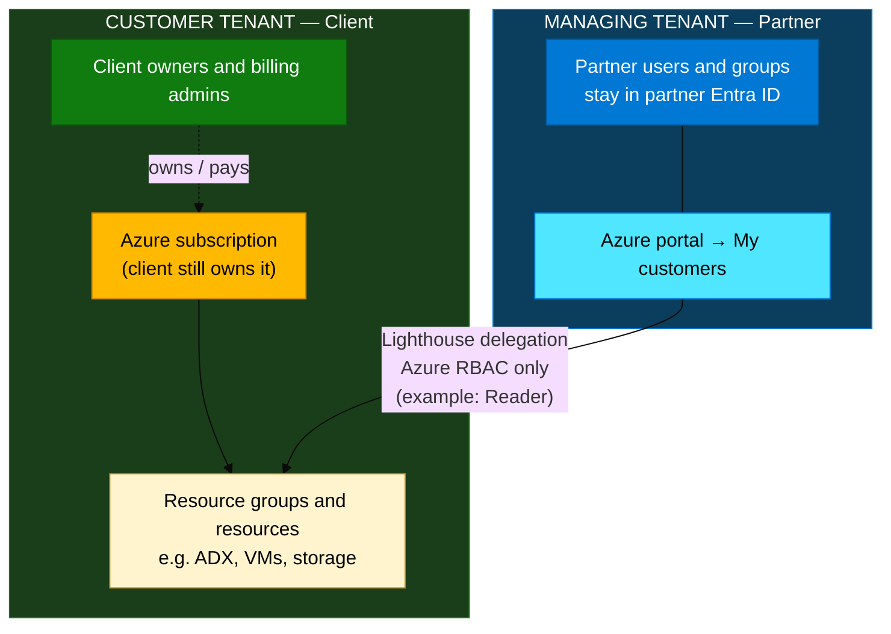
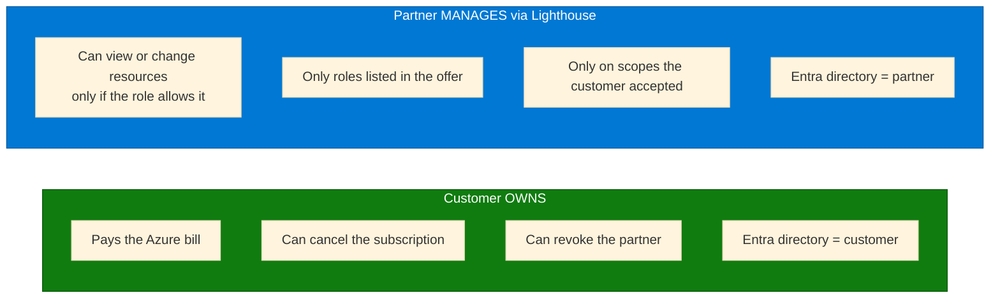
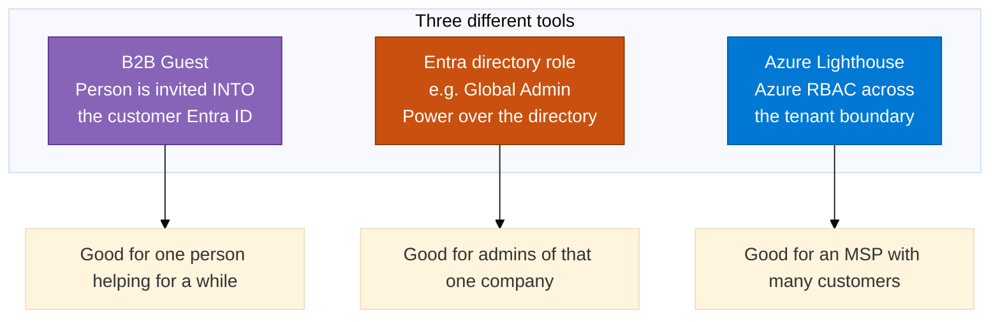
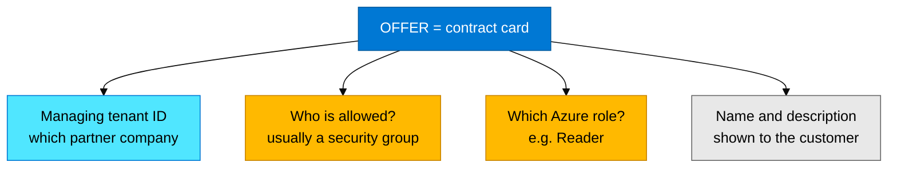
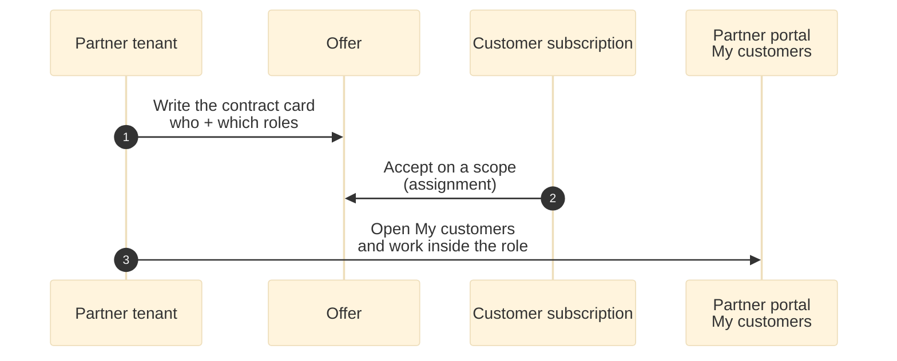
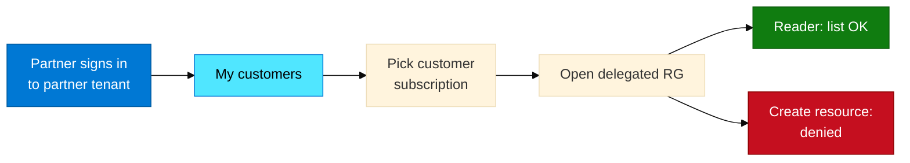
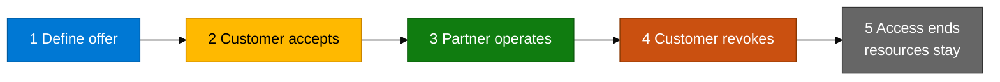
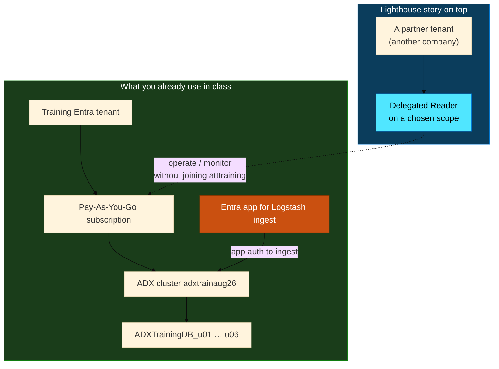
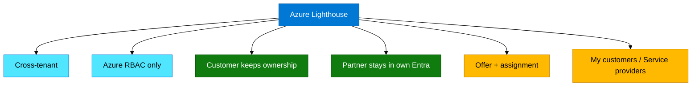

# Module 09 — Azure Lighthouse concepts

> **Reading order:** Primer → Concepts (this file) → Exercises.

This module is **concepts only**. You learn how Azure Lighthouse works with diagrams and plain English. There is no hands-on lab and no second tenant in class.

---

## 1. Start with a story

Imagine a company called **Contoso Consulting**. Contoso helps many clients run Azure.

- Client **A** has its own Entra ID (its own company login world) and its own Azure bill.  
- Client **B** has another Entra ID and another bill.  
- Client **C** the same.

Contoso’s engineers already have accounts in **Contoso’s** Entra ID. Contoso does **not** want to:

1. Create a guest account for every engineer inside **every** client tenant, or  
2. Ask clients for Global Admin passwords, or  
3. Force every client to join Contoso’s one big tenant (clients would lose isolation and clear billing).

Clients want something else:

> “Contoso may **look after** these Azure resources, with **limited** rights. **We** still own the subscription. We can **stop** Contoso anytime.”

That packaged, cross-company grant is what **Azure Lighthouse** is for.

| Bad pattern | Why it hurts |
|-------------|--------------|
| Guests everywhere | Hard to join/leave; client must manage Contoso people |
| Shared passwords | No real audit; security risk |
| One mega-tenant | Clients lose separation, compliance, and clear ownership |

**Simple definition:** Lighthouse lets a **partner tenant** receive **Azure roles** (like Reader) on a **customer subscription or resource group**, without moving the partner’s people into the customer’s Entra ID.

---

## 2. Two tenants, one clear job each

In Lighthouse language:

| Name | Who | Everyday meaning |
|------|-----|------------------|
| **Managing tenant** | Partner / MSP (Contoso) | Where Contoso staff sign in every day |
| **Customer tenant** | Client | Where the client’s users and billing live |
| **Scope** | Subscription or resource group | *Which* Azure resources Contoso may touch |
| **Role** | e.g. Reader, Contributor | *How much* Contoso may do |

**Three sentences to remember**

1. Contoso staff sign in to **Contoso**, not as permanent guests in every client.  
2. The client still **owns** the subscription (pays, can cancel, can revoke Contoso).  
3. What Contoso receives is **Azure Resource Manager permission** on a chosen scope — **not** “Global Admin of the client’s Entra directory.”

---

## 3. Ownership vs management (do not mix these up)

This is the most important distinction in the module.

**Own** = “This is my subscription.”  
**Manage (via Lighthouse)** = “You allowed me to operate inside rules you set.”

| Question | Simple answer |
|----------|----------------|
| After Lighthouse, whose subscription is it? | Still the **customer’s** |
| Can the partner delete the customer’s Entra tenant? | **No** |
| Can the customer remove the partner tomorrow? | **Yes** — remove the delegation (assignment) |
| Does Lighthouse make Contoso a Global Admin of the client? | **No** — only the Azure roles in the offer |

Analogy: giving a building contractor a **key to one floor** is not the same as putting them on the **property deed**. Lighthouse is the key (with a role and a floor). Ownership stays with the client.

---

## 4. Three tools people confuse — keep them separate

People often say “just add them to our Azure AD” or “give them Owner.” Those are different tools.

| Tool | Where the person “lives” | What they get |
|------|--------------------------|---------------|
| **B2B guest** | Appears inside the **customer** tenant as a guest | Whatever roles the customer assigns locally |
| **Entra directory role** | Inside one directory | Power over **users/apps** in that directory (not the same as Azure Owner) |
| **Lighthouse** | Stays in the **partner** tenant | Azure resource roles on a customer scope, by delegation |

**Classroom line for this ADX course**

- Module 05 **Entra app** for Logstash = “an application may **ingest data** into ADX.”  
- Module 09 **Lighthouse** = “a partner company may **operate Azure resources** in another company’s subscription.”  

Same cloud family, **different problems**. Do not mix them.

---

## 5. The contract: offer + assignment

Lighthouse does not use a handshake and hope. It uses two named pieces.

### Offer (also called registration definition)

Think of a **contract card** the partner prepares:

- Which partner tenant is managing?  
- Which partner users or **groups** are allowed?  
- Which Azure role do they get? (for teaching, often **Reader** = view only)

**Why a group instead of one user?**  
When Contoso hires or fires an engineer, they add/remove the person from the group in Contoso’s Entra ID. They do not rewrite the whole customer contract for every hire.

### Assignment (acceptance)

An offer alone does nothing useful until the **customer accepts** it on a **scope**:

- Whole subscription, or  
- One resource group (narrower permission)

| Piece | Plain English |
|-------|----------------|
| Offer | “Here is who we are and what roles we ask for.” |
| Assignment | “Yes — you may have those roles on **this** subscription or RG.” |

| Safer choice | Riskier choice |
|--------------|----------------|
| One **resource group** + **Reader** | Entire subscription + **Owner** |

In real designs, start narrow (one RG + least privilege). Do not grant Owner on a production ADX resource group without a strong reason.

---

## 6. After acceptance — a day in the partner’s life

Once the customer has accepted:

1. Partner engineer signs in to the **partner** tenant (normal Contoso login).  
2. Opens Azure portal → **My customers**.  
3. Selects the customer subscription.  
4. Opens the delegated resource group.  
5. Can **list** resources if the role is Reader.  
6. **Create / delete** should fail if only Reader was granted — that proves the limit works.

On the **customer** side, the relationship shows under **Service providers** (or similar Lighthouse customer blades). That is the mirror view: “who did we allow in?”

### Lifecycle (create → use → stop)

**Revoke ≠ delete the customer’s VMs or ADX.**  
Revoke only removes the cross-tenant permission bridge. The customer’s resources remain; the partner simply cannot manage them that way anymore.

---

## 7. How this maps to *your* ADX training

You already work in **one** training tenant (`atttraining`) and one Pay-As-You-Go subscription with ADX and per-student databases.

| What you did in Modules 01–08 | Is that Lighthouse? |
|-------------------------------|---------------------|
| Ingest logs from S3 / Logstash / GuardDuty into ADX | **No** — that is **data** moving into ADX |
| Entra app + secret for the kusto plugin | **No** — that is **app authentication** for ingest |
| A partner company operating many customers’ Azure (including ADX RGs) from its own tenant | **Yes** — that is the Lighthouse **ops** story |

So: this module does not change how you ingest. It answers a governance question: *how would a partner manage Azure across customers cleanly?*

---

## 8. Checkpoint — can you explain it simply?

Try answering in plain words (no jargon dump):

1. Who **owns** the subscription after a Lighthouse delegation?  
2. Does Lighthouse make the partner a **Global Admin** of the customer Entra ID?  
3. What is an **offer**? What is an **assignment**?  
4. Guest user vs Lighthouse — which scales better for 100 customers?  
5. Why is **Reader** on one resource group safer than **Owner** on the whole ADX resource group?  
6. Is the Logstash Entra app the same thing as Lighthouse? Why or why not?

---

## 9. One-slide summary

**One sentence to keep:**  
*Lighthouse lets a partner manage Azure resources in a customer subscription by delegated roles, without moving identities into the customer tenant and without taking ownership away from the customer.*
