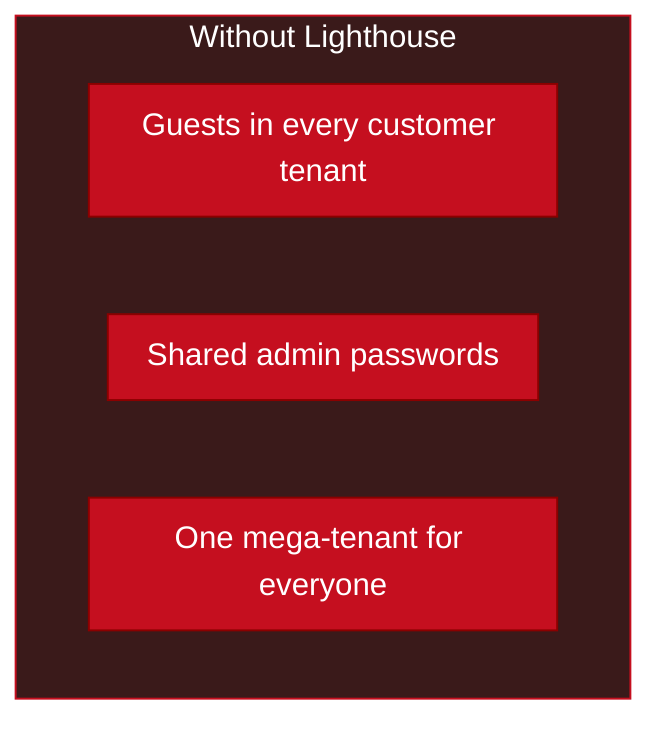
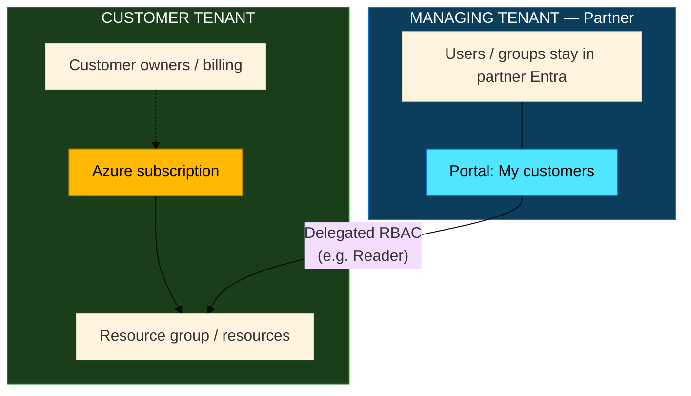
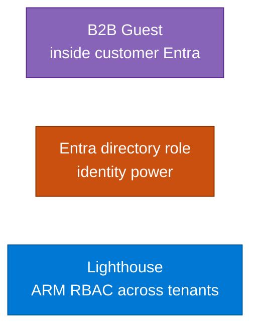
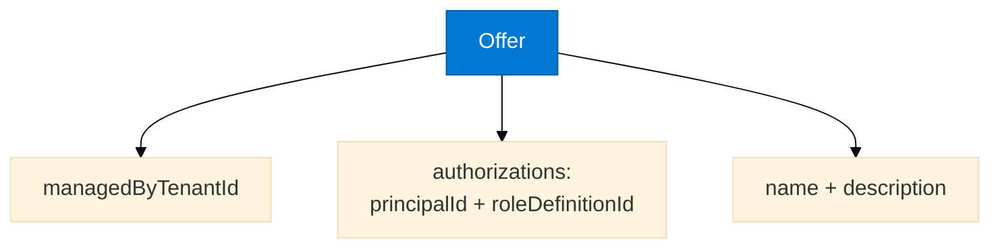
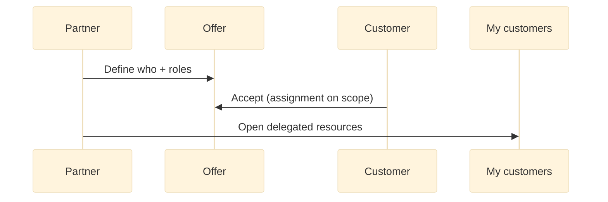
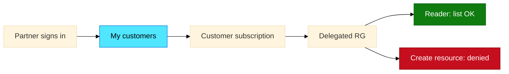
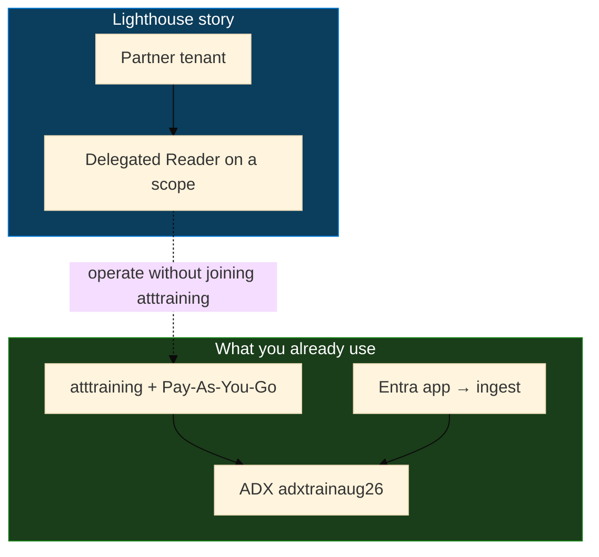

# Module 09 — Azure Lighthouse concepts

> **Reading order:** Primer → Concepts (this file) → Lab → Exercises.

Enough detail to **prove and explain** the idea. Full two-tenant deploy is optional for the trainer; students follow the portal walk in the Lab.

---

## 1. The problem

An MSP supports Customer A, B, C… each with their own Entra tenant and Azure subscriptions.

Lighthouse packages cross-tenant **Azure RBAC** as an **offer** the customer accepts.

---

## 2. Big picture

Say out loud:

1. Partner signs in to the **partner** tenant.  
2. Customer **keeps ownership** (bill, cancel, revoke).  
3. What crosses the boundary is **Azure RBAC on a scope** — not Global Admin of customer Entra.

---

## 3. Ownership vs management

| Who **owns** | Who **manages** via Lighthouse |
|--------------|--------------------------------|
| Pays the bill | Views / operates within granted roles |
| Can cancel the subscription | Only roles listed in the offer |
| Can revoke the delegation | Only on accepted scopes |
| Directory = customer Entra | Directory = partner Entra |

| Question | Answer |
|----------|--------|
| Whose subscription is it after Lighthouse? | **Customer’s** |
| Does the partner become Global Admin of customer Entra? | **No** |
| Can the customer end access? | **Yes** — remove the assignment |

---

## 4. Guest vs Entra role vs Lighthouse

| Tool | Best for |
|------|----------|
| Guest | One collaborator |
| Entra role | Admins of **that** directory |
| Lighthouse | MSP scale — many customers, same partner identities |

---

## 5. Offer + assignment (the contract)

**Offer (registration definition)** = who in the partner tenant gets which Azure role.

Built-in **Reader** role ID (common in demos): `acdd72a7-3385-48ef-bd42-f606fba81ae7`

Prefer authorizing a **security group** so you add/remove engineers without redeploying the offer.

**Assignment** = customer accepts that offer on a **subscription** or **resource group**.

| Safer demo scope | Riskier |
|------------------|---------|
| One demo RG + **Reader** | Whole subscription + **Owner** |

---

## 6. After acceptance — My customers

Lifecycle: define offer → customer accepts → partner operates → customer **revokes** assignment → access ends; customer resources remain.

---

## 7. Map to this training

| Course piece | Lighthouse? |
|--------------|-------------|
| Log ingest (S3 / Logstash / GuardDuty) | **No** — data plane |
| Entra app secret for kusto plugin | **No** — app auth |
| Partner ops across customer Azure | **Yes** |

---

## Checkpoint questions

1. Who owns the subscription after delegation?  
2. Is Lighthouse the same as inviting a guest?  
3. Why use an **offer** + **assignment** instead of one-off portal clicks?  
4. Why prefer **Reader** on one RG for a first demo?

**One-line summary:** *Partner stays home; customer keeps ownership; Azure RBAC crosses the tenant boundary by delegation.*
