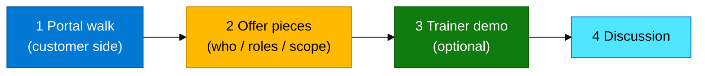

# Module 09 — Lab (Azure Lighthouse)

**Reading order:** Primer → Concepts → **this Lab** → Exercises.

**Goal:** Prove the concept in the **Azure portal** (and optionally watch a short trainer demo).  
You do **not** need to build a full two-tenant production MSP setup yourself.

**Sign-in:** Azure portal with your training Entra account → subscription **Pay-As-You-Go** (same as ADX labs).

---

## What “practical” means here

| Activity | Who |
|----------|-----|
| Portal walk — Service providers / delegations blades | Everyone |
| Name the pieces of an offer (no templates to deploy) | Everyone |
| Optional live **My customers** demo (needs a second tenant) | Trainer shows; you watch |

Two tenants are often awkward in a classroom. The walk below still proves the **concept**. If the trainer has a managing + customer pair ready, they can show the end state on screen.

---

## Step 1 — Portal walk (customer / training subscription)

### Why

On the **customer** side you see where delegations and service-provider relationships show up. Even with no active offer, the blades teach the vocabulary.

### Do this (Azure portal)

1. Sign in → confirm directory/subscription is the **training** Pay-As-You-Go (where ADX lives).  
2. Top search → type **`Service providers`** (or **Azure Lighthouse**).  
3. Open **Service providers** (customer experience).  
4. Note the empty or existing list of providers / delegations — this is where an accepted partner relationship appears.  
5. Optional: open resource group **`rg-adx-training-aug26`** (ADX). Remind yourself: a **first demo** should never grant a partner **Owner** on this RG — use a separate demo RG + **Reader** if anyone ever deploys for real.

### Checkpoint

You can find the Service providers / Lighthouse area and explain it is the **customer** view of partner access.

---

## Step 2 — What an offer contains (contract card)

### Why

An offer answers: *which partner tenant*, *which people/groups*, *which Azure role*, and (when assigned) *on what scope*.

You do **not** need to write Bicep or ARM for this module. Learn the pieces by name:

| Piece | Meaning |
|-------|---------|
| Managing tenant ID | Partner Entra tenant |
| Principal | User, group, or service principal in the **partner** tenant (prefer a group) |
| Azure role | e.g. **Reader** (list/view only) |
| Offer (registration definition) | Packages tenant + principals + roles |
| Assignment | Customer **accepts** that offer on a subscription or resource group |

Built-in Reader role ID (if you ever see it in docs): `acdd72a7-3385-48ef-bd42-f606fba81ae7`

### Checkpoint

In one sentence: *Offer = who/what roles; assignment = customer accepts on a scope.*

---

## Step 3 — Trainer demo (optional, screen share)

Trainer only — if a **managing tenant** and a prior or prepared delegation exist:

1. Sign in as the **partner** tenant.  
2. Portal search → **My customers**.  
3. Open the delegated customer subscription / RG.  
4. Show **list** works with Reader; attempt **Create** and show it fails (if role is Reader).  
5. Switch back to the **customer** tenant → Service providers → show the relationship from the other side.

If no second tenant is available today: trainer walks Concepts diagrams §2–§6 on screen instead. That still counts as the demo for this module.

### What you should notice as a student

- Partner never “became” a user inside `atttraining` for that ops path.  
- Customer ownership did not move.  
- Access is scoped (role + RG/subscription).

---

## Step 4 — Discussion (whole room)

Answer out loud (or in chat):

1. Who **owns** the Pay-As-You-Go subscription after a Lighthouse delegation?  
2. Guest user vs Lighthouse — which scales for 100 customers?  
3. Why is **Reader** on a **demo RG** safer than **Owner** on `rg-adx-training-aug26`?  
4. Is the Logstash Entra app the same as Lighthouse? Why / why not?

---

## Done when

- You can draw managing vs customer vs delegated RG  
- You can explain offer vs assignment  
- You found the Service providers blade (or watched the trainer open it)  
- You know Lighthouse ≠ guest ≠ Logstash Entra app  

---

## If something is unclear

| Question | Pointer |
|----------|---------|
| I don’t see My customers | That blade is on the **managing** tenant — trainer demo or Concepts diagram |
| Should I deploy anything? | Not required — this module is portal + concept; optional trainer demo only |
| Will this break ADX? | Not if you only browse portals; never assign Owner on the ADX RG in class |
