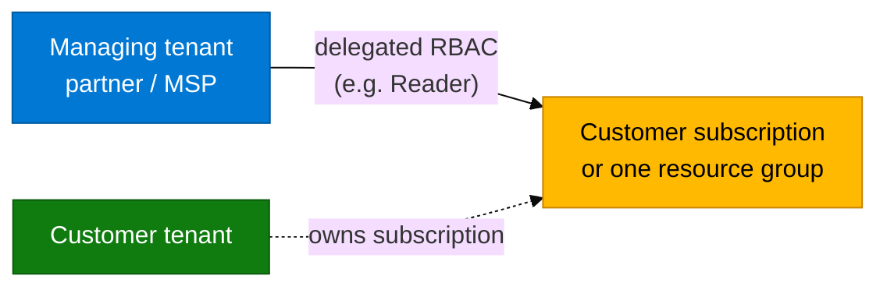

# Module 09 — Azure Lighthouse primer

Read this **before** `09_Azure_Lighthouse_Concepts.md`.

## One sentence

**Azure Lighthouse** = a partner (MSP) manages Azure resources in a **customer** subscription by **delegated RBAC**, while staying signed into the **partner** Entra tenant. The customer still **owns** the subscription.

## Why it exists

Partners support many customers. Each customer has their own Entra ID tenant. Without Lighthouse, partners often:

- Invite every engineer as a **B2B guest** into every customer tenant, or  
- Share admin passwords, or  
- Push everyone into one mega-tenant  

Those patterns do not scale and hurt security/compliance.

**What the customer wants:** *“You may operate **these** resources with **these** roles — we still own billing and can revoke you.”*

---

## What it is not

| Confused with | Difference |
|---------------|------------|
| Entra **B2B guest** | Guest lands *inside* the customer tenant. Lighthouse keeps the partner in *their* tenant. |
| Entra **directory roles** (Global Admin, …) | Identity-directory power. Lighthouse is **Azure Resource Manager** RBAC only. |
| Logstash **Entra app** | App auth for **data ingest**. Lighthouse is **ops access** to Azure resources. Different problem. |

---

## Vocabulary

| Term | Meaning |
|------|---------|
| Managing tenant | Partner / MSP Entra tenant |
| Customer (managed) tenant | Client Entra tenant |
| Offer / registration **definition** | Packaged “who + which Azure roles” |
| Registration **assignment** | Customer acceptance on a subscription or RG |
| **My customers** | Portal blade in the managing tenant to open delegated subscriptions |

**Next:** read `09_Azure_Lighthouse_Concepts.md`, then try `09_Exercises.md`.
