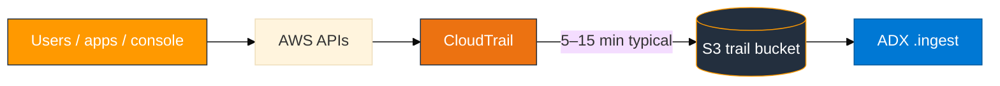
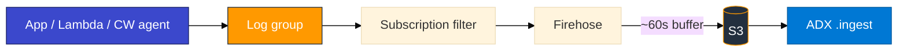

# Real data vs lab scripts

In production, telemetry arrives continuously from services and users. In class we sometimes use **scripts** so everyone gets recognizable events in predictable time. This page explains both paths.

## Summary by module

| Module | Production / “real-time” source | Why we also use scripts in lab | Script (if any) |
|--------|----------------------------------|--------------------------------|-----------------|
| **01 S3** | Any AWS CLI or console action you take | Script **is** real data — it calls live APIs (`sts`, `s3`, `ec2`) | `capture_and_upload.sh` |
| **02 CloudTrail** | Every API call in your account (console, CLI, SDK, other users) | Trail delivery to S3 takes **5–15 minutes**; script creates **labeled** events you can find in KQL | `generate_events.sh` |
| **03 CloudWatch** | Apps, Lambda, CW agent → log groups (JSON lines: orders, auth, latency) | Prefer `app_traffic_simulator.sh` (checkout-API shape); `put_log_events.sh` only for **quick pipeline smoke** | `app_traffic_simulator.sh`, `put_log_events.sh` |
| **05–07** | OS logs, nginx/httpd, CPU/memory on the Linux lab VM | Beats/Logstash run on a **shared VM** with turn-taking | Module lab configs |

## Module 01 — already “live”

`capture_and_upload.sh` does **not** fabricate JSON. It runs:

- `aws sts get-caller-identity`
- `aws s3api list-buckets`
- `aws ec2 describe-regions`

…and writes the **actual responses** to NDJSON/CSV. If you create a bucket in the console and re-run the script, new rows appear — that is real inventory, not a canned file.

**Real-time alternative:** Use the account normally (console clicks, CLI commands). Re-run capture when you want a fresh snapshot in S3.

## Module 02 — real CloudTrail, delayed delivery

### Real-time flow (production)



CloudTrail is **always recording** management events on the shared classroom trail. You do **not** need a script for data to exist — but you **do** need to wait for S3 delivery and know which events are yours.

### Generate real activity (no script)

Any of these create **real** trail events under your IAM user:

1. **Console:** S3 → create/delete a test bucket; IAM → list users; EC2 → view regions.
2. **CLI:** `aws s3 ls`, `aws iam list-users`, `aws sts get-caller-identity` (same as daily work).
3. **Wait 5–15 minutes**, then list S3:

```bash
ACCOUNT=$(aws sts get-caller-identity --query Account --output text)
aws s3 ls "s3://adx-classroom-cloudtrail/AWSLogs/${ACCOUNT}/CloudTrail/us-east-1/" --recursive | tail -5
```

Filter in ADX: `CloudTrailEvents | where UserArn contains "<your-login>"`

### Why `generate_events.sh` exists

- Creates **distinct** events (temp bucket + temp IAM user create/delete) so beginners can confirm expand worked.
- Runs in **one command** while you build tables/IAM during the trail delay.
- Still **real API calls** — not synthetic JSON files — only **orchestrated** for teaching.

### Bulk ingest without naming each file

ADX cannot ingest `s3://bucket/prefix/*` wildcards on this cluster. Use:

```bash
bash assets/ingest_s3_to_adx.sh --module m02 --login <your-login> --max 5 [--run]
```

Same script supports `--module m01|m03|m08` with nested prefix listing. See `assets/ingest_s3_to_adx.sh --help`.

## Module 03 — real pipeline; prefer real-shaped application logs

### Real-time flow (production)



In production, **nothing special “generates lab data.”** Services emit logs as they run:

| Real project source | What appears in CloudWatch | Classroom fit |
|---------------------|----------------------------|---------------|
| **Microservice / API** (SDK `PutLogEvents` or logging library → CW) | Structured JSON: order id, user id, latency, HTTP status | **Primary lab path** — `app_traffic_simulator.sh` |
| **AWS Lambda** | Automatic `/aws/lambda/<name>` streams on every invoke | Optional stretch (trainer/permissions) |
| **CloudWatch agent on EC2** | `/var/log/secure`, nginx access, app `.log` files | Later modules (Linux VM) + optional M03 tip |
| **Container Insights / ECS / EKS** | Task/pod stdout → log groups | Out of scope for this short lab |
| **Console “Create log event”** | Manual lines (support / debug) | Fine for one-off checks |

The **pipeline** (filter → Firehose → S3 → ADX) is identical for all sources. Only **who writes the log line** changes.

### What to run in class (recommended order)

1. **Finish lab Step 1** (log group, Firehose Active, subscription filter). Events before the filter **never** backfill to S3.
2. **Generate real-shaped traffic** (preferred):

```bash
export MSYS_NO_PATHCONV=1
bash assets/module_03/app_traffic_simulator.sh us-east-1 <your-login>
```

This writes multi-event batches that look like a **checkout API**: health checks, login success/fail, order create, payment, stock-out errors, slow requests — with `service`, `host`, `traceId`, `latencyMs`, etc.

3. **Quick smoke only** (three probe lines with your ARN):

```bash
bash assets/module_03/put_log_events.sh us-east-1 <your-login>
```

Use this when you only need to prove S3 got *something* before building ADX tables.

### Real-world tips (how teams actually produce CW Logs)

1. **Log shape** — Prefer one **JSON object per line** (`level`, `service`, `event`, `traceId`, business ids). That is what ADX `parse_json` and Logs Insights expect.
2. **Log stream naming** — Production often uses instance id, task id, or request date. Lab uses `Instance_01_<login>` so every student has a stable name.
3. **Never write before the subscription exists** — Same rule in prod when you add a new Firehose destination: enable the filter, then redeploy / resume traffic.
4. **Verify in CloudWatch first** — Console → Log groups → stream → confirm INFO/WARN/ERROR, then wait for Firehose (~60–90s) → list S3. Do not jump straight to ADX if the stream is empty.
5. **Console alternative (no script):** Log group → stream → **Create log event** → paste a JSON line such as `{"level":"ERROR","service":"checkout-api","event":"payment.declined","orderId":"ord-demo-1"}`. Repeat 5–10 times with different `event` values.
6. **CLI one-liner (manual “real” line):**

```bash
export MSYS_NO_PATHCONV=1
aws logs put-log-events \
  --log-group-name "/adx-training/app-logs-<your-login>" \
  --log-stream-name "Instance_01_<your-login>" \
  --log-events '[{"timestamp":'$(($(date +%s)*1000))',"message":"{\"level\":\"INFO\",\"service\":\"checkout-api\",\"event\":\"order.created\",\"orderId\":\"ord-manual-1\"}"}]'
```

(If the stream already has events, add `--sequence-token` from `describe-log-streams` — the simulator script does this for you.)

7. **Optional Lambda path (stretch):** Create a tiny Lambda that `print()`s JSON, invoke it 3 times, attach a **second** subscription filter from `/aws/lambda/<name>` to the same Firehose (or create a dedicated Firehose). That is how serverless teams feed the same S3 → ADX path without a custom log group.

### Why keep `put_log_events.sh`

- Fast pipeline proof after Step 1.
- Guarantees three messages with **your live account id and ARN**.
- Not a replacement for application-shaped traffic — use `app_traffic_simulator.sh` (or console events) for the “real project” feeling.

## When scripts feel “artificial” — and why that is OK here

| Concern | Answer |
|---------|--------|
| “Scripts aren’t production” | M01/M02 scripts invoke **real AWS APIs**. M03’s **pipeline** is production-shaped; `app_traffic_simulator.sh` mimics microservice log lines via the same PutLogEvents API apps use. |
| “Not real time” | CloudTrail S3 delay and Firehose buffering are **AWS platform** behaviors — production pipelines have the same waits (or use streaming ingest products). |
| “I want continuous ingest” | Production may use Event Grid, Lambda, or ADX data connections — out of scope for Module 02/03’s `.ingest` lesson |

The lab teaches **the ingest contract** (S3 object → mapping → table). Prefer **realistic log content**; use short scripts only to save class time on plumbing.
