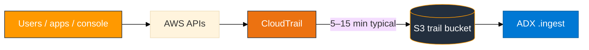

# Real data vs lab scripts

In production, telemetry arrives continuously from services and users. In class we sometimes use **scripts** so everyone gets recognizable events in predictable time. This page explains both paths.

## Summary by module

| Module | Production / “real-time” source | Why we also use scripts in lab | Script (if any) |
|--------|----------------------------------|--------------------------------|-----------------|
| **01 S3** | Any AWS CLI or console action you take | Script **is** real data — it calls live APIs (`sts`, `s3`, `ec2`) | `capture_and_upload.sh` |
| **02 CloudTrail** | Every API call in your account (console, CLI, SDK, other users) | Trail delivery to S3 takes **5–15 minutes**; script creates **labeled** events you can find in KQL | `generate_events.sh` |
| **03 CloudWatch** | Apps, Lambda, EC2 agents, Container Insights → log groups | Subscription + Firehose must exist first; script sends **structured test lines** with your ARN | `put_log_events.sh` |
| **05–07** | OS logs, nginx/httpd, CPU/memory on the Linux lab VM | Beats/Logstash run on a **shared VM** with turn-taking | Module lab configs |

## Module 01 — already “live”

`capture_and_upload.sh` does **not** fabricate JSON. It runs:

- `aws sts get-caller-identity`
- `aws s3api list-buckets`
- `aws ec2 describe-regions`

…and writes the **actual responses** to NDJSON/CSV. If you create a bucket in the console and re-run the script, new rows appear — that is real inventory, not a canned file.

**Real-time alternative:** Use the account normally (console clicks, CLI commands). Re-run capture when you want a fresh snapshot in S3.

## Module 02 — real CloudTrail, delayed delivery

### Real-time flow (production)



CloudTrail is **always recording** management events on the shared classroom trail. You do **not** need a script for data to exist — but you **do** need to wait for S3 delivery and know which events are yours.

### Generate real activity (no script)

Any of these create **real** trail events under your IAM user:

1. **Console:** S3 → create/delete a test bucket; IAM → list users; EC2 → view regions.
2. **CLI:** `aws s3 ls`, `aws iam list-users`, `aws sts get-caller-identity` (same as daily work).
3. **Wait 5–15 minutes**, then list S3:

```bash
ACCOUNT=$(aws sts get-caller-identity --query Account --output text)
aws s3 ls "s3://adx-classroom-cloudtrail/AWSLogs/${ACCOUNT}/CloudTrail/us-east-1/" --recursive | tail -5
```

Filter in ADX: `CloudTrailEvents | where UserArn contains "<your-login>"`

### Why `generate_events.sh` exists

- Creates **distinct** events (temp bucket + temp IAM user create/delete) so beginners can confirm expand worked.
- Runs in **one command** while you build tables/IAM during the trail delay.
- Still **real API calls** — not synthetic JSON files — only **orchestrated** for teaching.

### Bulk ingest without naming each file

ADX cannot ingest `s3://bucket/prefix/*` wildcards on this cluster. Use:

```bash
bash assets/ingest_s3_to_adx.sh --module m02 --login <your-login> --max 5 [--run]
```

Same script supports `--module m01|m03|m08` with nested prefix listing. See `assets/ingest_s3_to_adx.sh --help`.

## Module 03 — real pipeline, scripted log lines

### Real-time flow (production)

Applications and AWS services write to CloudWatch Logs continuously. A **subscription filter** pushes matching log streams to Firehose → S3 in near real time (buffer ~60s in our lab).

Examples of **real** sources (not used in the minimal lab):

- EC2 CloudWatch agent → log group for `/var/log/messages`
- Lambda function logs (automatic log group)
- Application code using AWS SDK `PutLogEvents`

### Why `put_log_events.sh` exists

- You must create log group, Firehose, and subscription filter **before** any export.
- A standalone script guarantees three **JSON messages** with your **live account id and ARN** for KQL checks.
- Events sent **before** the subscription filter exists are **never** backfilled to S3.

### Real alternative after the pipeline exists

Once Step 1 of the lab is done, anything that writes to your log group is “real”:

```bash
export MSYS_NO_PATHCONV=1
aws logs put-log-events \
  --log-group-name "/adx-training/app-logs-<your-login>" \
  --log-stream-name "Instance_01_<your-login>" \
  --log-events '[{"timestamp":'$(($(date +%s)*1000))',"message":"manual console test"}]'
```

Or install the CloudWatch agent on a host (outside scope of the short lab).

## When scripts feel “artificial” — and why that is OK here

| Concern | Answer |
|---------|--------|
| “Scripts aren’t production” | M01/M02 scripts invoke **real AWS APIs**; M03 uses **real CloudWatch/Firehose/S3** with **hand-written log lines** |
| “Not real time” | CloudTrail S3 delay is an **AWS platform** behavior — production pipelines use the same wait or event-driven ingest |
| “I want continuous ingest” | Production uses Event Grid, Lambda, or ADX data connections — out of scope for Module 02’s `.ingest` lesson |

The lab teaches **the ingest contract** (S3 object → mapping → table). Scripts shorten setup; the **data path** matches production.
